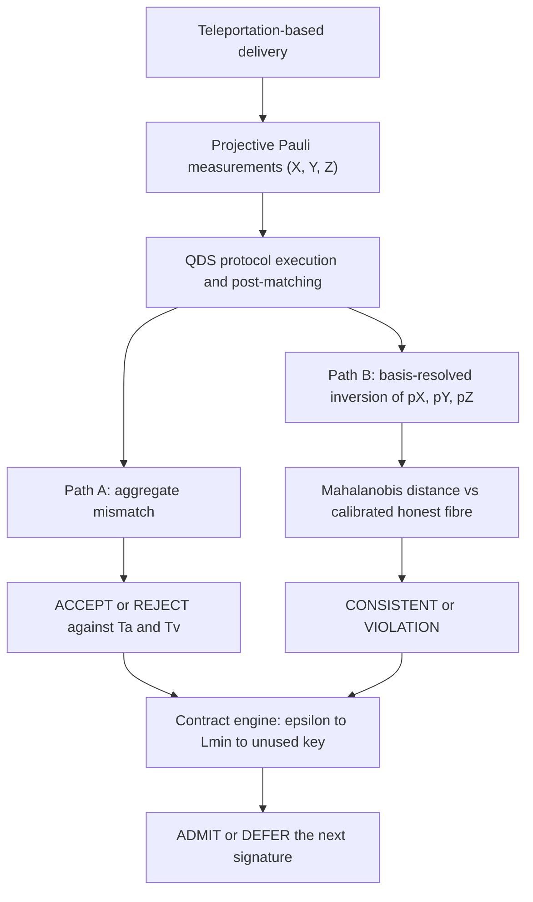

# Q-DETECT — Quantum-Inspired Cyber Threat Detection for Digital Signature Security

**Smart India Hackathon 2026 · Problem Statement SIH26141 · Team Qubit Qurious (R16-202)**

**Live prototype:** https://q-detect.onrender.com/

| Field | Details |
|---|---|
| Problem statement | SIH26141: Quantum-Inspired Cyber Threat Detection for Digital Signature Security |
| Theme / category | Blockchain and Security / Software |
| Team | Qubit Qurious (ID R16-202) |
| Mentor | Dr. Pawan Singh Mehra |

> The live site runs on Render's free tier, so it sleeps when idle. If the page is slow, wait about 30 seconds for it to wake up.

---

## What is Q-DETECT?

Q-DETECT is a **pure-software threat detection and resource management framework for teleportation-based quantum digital signatures (QDS)**. It is a simulator plus a web dashboard, not lab hardware, and it uses **no machine-learning libraries**.

It takes a peer-reviewed signature protocol (Weng et al., 2021) as its core and adds two layers around it:

1. **A basis-resolved anomaly detector** that looks at the *shape* of the errors on the X, Y and Z axes, not just the total error rate.
2. **A fail-closed contract engine** that decides whether the link is trustworthy enough, and has enough unused key, to sign the *next* message.

### The core idea

An honest, slightly noisy fibre and an attacker who biases a single axis can both produce the **same ~7% total error rate**. A scalar check (the standard QBER test) cannot tell them apart. Q-DETECT can, because the *distribution* of errors across the three axes is different.

| Detector | False alarm rate | Detection rate |
|---|---:|---:|
| Aggregate error-rate check (best fixed threshold, calibrated on held-out honest data) | 0.67% (1/150) | 2.0% (3/150) |
| **Q-DETECT** (basis-resolved Mahalanobis test) | **0.00% (0/150)** | **100% (150/150)** |

Measured by `experiments/detector_comparison.py` against the full pipeline (teleportation → SARG04 → Weng protocol → detector): 150 honest and 150 axis-biased runs of 200,000 pulses each. The highest honest distance is D² = 4.3; the lowest attacked distance is D² = 4,646. The data is in [`experiments/results/detector_comparison.json`](experiments/results/detector_comparison.json).

---

## How the signature protocol works

Alice wants to **sign a message** so Bob and Charlie can be sure it came from her, even after quantum computers exist.

1. Alice prepares random six-state quantum keys and **teleports** them to Bob and Charlie (the secret particles never travel down the fibre).
2. Recipients measure in a random basis X, Y or Z.
3. **Post-matching** aligns Charlie's sequence with Bob's, so Alice cannot give Bob good keys and Charlie bad ones and then deny signing.
4. Alice publishes the classical key for message bit `m`.
5. **Bob** checks his mismatch rate against a strict threshold `T_a`. If it passes, he forwards only classical data.
6. **Charlie** checks against his own keys at a looser threshold `T_v`.

The two Q-DETECT layers sit **beside** this verdict and never override it.

---

## Architecture



- **Path A (cryptographic verification):** the aggregate error rate is checked against Weng's thresholds `T_a` and `T_v`, giving ACCEPT or REJECT. It is blind to which axis the errors are on.
- **Path B (assurance and anomaly detection):** public basis declarations are reused to extract the error vector `(p_X, p_Y, p_Z)` in a single O(N) algebraic pass (three equations, three unknowns). A Mahalanobis distance against the fibre's calibrated, anisotropic honest baseline then gives CONSISTENT or VIOLATION.
- **Contract engine:** maps the requested security level ε to the minimum finite-key length `L_min`, compares it with the unused key pool, and returns ADMIT or DEFER. If the requested security is unreachable, it **defers** (fail closed) rather than issuing a weaker signature.

---

## What the dashboard shows

Three questions, three answers. Do not mix them.

| Tile | Question | Values |
|---|---|---|
| **Protocol** (QDS verifier) | Is this signature valid? | **ACCEPT**: Bob passed (`T_a`) and Charlie passed (`T_v`). **REJECT**: Charlie did not accept. **ABORT (Bob)**: Bob never forwarded. |
| **Q-DETECT** | Does the error shape still match this fibre's calibrated honest pattern? | **CONSISTENT**: yes. **VIOLATION**: no. This means "security model mismatch", not automatically "an eavesdropper". |
| **Contract** | May we sign the next message? | **ADMIT**: link looks honest enough and key material remains. **DEFER**: stop. Reasons include a Q-DETECT violation, a fibre too noisy for the security margin, or not enough unused key. |

Q-DETECT never changes ACCEPT/REJECT. A row can be **ACCEPT + VIOLATION + DEFER**: this signature was valid, but do not use the link for the next one.

The **centrepiece table** adds one row for every run, newest on top, so you can run several attacks and compare them side by side. Rows with a similar total error but a different axis breakdown show why a scalar check is not enough.

### Typical results

| Situation | Total error | Axis errors (e_X / e_Y / e_Z) | Protocol | Q-DETECT | Contract |
|---|---|---|---|---|---|
| Honest fibre | ~7% | ~7.8 / 7.2 / 6.0 (naturally a bit lopsided) | ACCEPT | CONSISTENT | ADMIT |
| Honest drift | ~7% | still the honest family | ACCEPT | CONSISTENT | ADMIT |
| Attacker biasing one axis (X, Y or Z) | ~7% (same total) | e.g. 10.5 / 10.5 / 0 | ACCEPT | VIOLATION | DEFER |
| Much noisier fibre, still honest-shaped | ~12% | compatible shape | ACCEPT | CONSISTENT | DEFER |
| Forgery (fake key string) | honest-looking channel | not applicable | REJECT | often CONSISTENT | ADMIT (the link is fine) |

Values in this table are for large runs (N = 200,000). The dashboard's default is N = 12,000, so its numbers vary around these (for example, an honest total error of about 6.3% instead of 6.9%). Set "Pulses per recipient N" to 200000 under *Advanced settings* to match.

The protocol stays at ACCEPT on the biased-axis attack because it only sees the total error, which is still under the line. That gap is what Q-DETECT closes.

Other numbers on the page:
- **E^cu vs T:** conclusive mismatch versus the authentication (`T_a`, Bob) or verification (`T_v`, Charlie) threshold.
- **P^c:** fraction of conclusive SARG04 results. Ideal is 1/6 ≈ 16.7%.
- **Pair click:** 100% at 0 km (lab mode). At 10 km both photons of a Bell pair survive about 60% of the time, so there are fewer samples.
- **Mahalanobis D²:** distance of the recovered error shape from the calibrated honest family. Above the 99% threshold means VIOLATION.

The *Advanced settings* dropdown has two operating points: **Detector demo** (7% anisotropic fibre, the table above) and **Weng** (a much quieter channel, e_d = 0.1%, where Weng's published forgery bound is the relevant budget; at 7% noise that bound is deliberately not shown).

---

## Threat coverage

| Threat | How the attack works | How Q-DETECT stops it |
|---|---|---|
| Axis-biased channel (X, Y, Z) | Single-axis Pauli error tuned to the honest ~7% aggregate, invisible to a scalar check | Basis-resolved Mahalanobis test → VIOLATION; contract DEFERs |
| Correction-bit tampering | Flips the two classical teleportation bits so the recipient applies the wrong Pauli | Authenticated bits (Wegman–Carter MAC); mismatch jumps to ~65% → REJECT |
| Forgery | Bob replaces Alice's untested key with a guess and forwards it | Dual thresholds `T_a` / `T_v`: the guessed key fails Charlie's check → REJECT |
| Replay | Reuses a consumed one-time key | One-time-key tracking |
| Repudiation | Alice gives Bob and Charlie different key material, then denies signing | Post-matching (Lu et al.) aligns Charlie's sequence to Bob's |
| Impersonation | A party who is not Alice offers a signature | Credential chain bound to key distribution |
| Unauthorized verification | A verifier that was never issued key material | Credential check → REJECT |

The dashboard offers 13 scenarios in total: Honest, Honest drift, Axis-biased X / Y / Z, Correction-bit tampering, Forgery, Replay, Alice repudiation, Unauthorized verification, Impersonation, Non-unital relaxation, and Shape-preserving magnitude scale. The simulator also defines an "invited but greedy" verifier scenario, available through the CLI and API. All attack definitions are in [`qdetect/attacks.py`](qdetect/attacks.py).

---

## Quick start

Python **3.10 or newer**. Run every command from the **project root** (the folder containing `qdetect/` and `dashboard/`).

```bash
python -m venv .venv
source .venv/bin/activate          # Windows:  .venv\Scripts\activate
python -m pip install -r requirements.txt
```

**Check the physics engine (15 tests):**

```bash
python -m pytest tests/ -q
```

**Run the dashboard:**

```bash
python dashboard/app.py            # opens on http://127.0.0.1:5055
# or on macOS/Linux:  ./run_dashboard.sh
```

To use another port: `QDETECT_PORT=8080 python dashboard/app.py` (on Windows PowerShell: `$env:QDETECT_PORT="8080"; python dashboard/app.py`).

Closing the browser tab does not stop the server. Press **Ctrl+C** in the terminal that started it, or run `./stop_dashboard.sh`.

> A local address like `127.0.0.1:5055` only works on the machine that started the server. To show others, use the live link above.

**Using the dashboard:**
1. Leave **Attack** on *Honest* for a first run, or pick an attack (Z-bias, forgery, replay, ...).
2. Optionally open *Advanced settings* to set the pulse count N, fibre length in km, seed and intensity.
3. Click the blue **Run live pipeline** button.
4. Wait for *Finished* under the button. The three tiles at the top update, and a new row appears in the centrepiece table.

Pre-computed evidence (seed 141) is in the **Seeded experiments** list inside *Show full technical detail*.

> **Tip: key reuse looks like a replay.** The protocol tracks one-time keys. Running the same attack twice with the same seed reuses the same key, so the second run is correctly REJECTED as a replay (this can make an *Honest* run look rejected). The key pool is also shared by everyone using the same server. Click **Reset key pool / credentials** (in *Advanced settings*) to start clean, or change the seed between runs.

**Command line, no browser:**

```bash
python -m qdetect --attack z_bias --n 12000 --km 0
```

**Regenerate experiments and the detector comparison:**

```bash
python experiments/generate_experiment.py --seed 141 --condition all

python experiments/detector_comparison.py calibrate   # phase 1: calibrate aggregate threshold
python experiments/detector_comparison.py test        # phase 2: held-out honest vs attacked runs
python experiments/detector_comparison.py plot        # phase 3: scatter plot (needs matplotlib)
```

A full 200,000-pulse run takes under one second on a laptop (measured at about 0.9 s). Everything is seeded, so results are reproducible.

---

## Deploy to Render

The repo includes `render.yaml` and a `Procfile`. In Render choose **New → Blueprint**, select this repo and apply. The start command is `gunicorn dashboard.app:app`. The free plan sleeps after inactivity.

---

## Honest scope and limitations

This project is deliberately explicit about what it does **not** claim.

- **Fixed-axis manipulation only.** Q-DETECT detects a fixed-axis channel bias. An adaptive eavesdropper who randomizes the attack direction can erase the axis signature.
- **Shape-preserving attacks.** An attack that keeps the honest error *shape* and only scales the magnitude is not an axis attack; a good aggregate detector can match or beat Q-DETECT there.
- **Out-of-model noise is flagged, not guessed.** Non-unital noise (for example amplitude damping) breaks the Pauli inversion, so Q-DETECT reports the failure instead of inventing a number.
- **Gaussian approximation.** The optimality claim (Neyman–Pearson optimal test for axis-biased manipulation, with no learned parameters) holds under a Gaussian approximation of the per-axis error rates.
- **Declared assumption.** Replacing Weng's direct transmission with teleportation plus the public Pauli correction is assumed to be equivalent for the security layer. This is not a published theorem, and Q-DETECT's domain is Pauli-twirled effective channels.
- **Not information-theoretic.** Weng's protocol is information-theoretically secure under its model; Q-DETECT's detection layer is a statistical assurance layer, not a security proof.
- **One documented deviation from the paper.** The code uses the phase-error formula from Yin et al. (2016), the source Weng cites, instead of Weng's printed intercept `(4−√2)/4`, which makes the phase error exceed 1/2 and collapses the forgery bound. The original can be selected with `phase_error_model='weng_printed'` (see `qdetect/finite_size.py`).
- **Credential limits.** The credential check catches never-invited verifiers (and a verifier that exceeds its quota). An invited verifier whose credential is stolen and used by someone else is currently not covered.
- **Not included:** entanglement or Bell-inequality verification, detector-hardware timing models, and adaptive basis-reweighting feedback.
- **Simulation, not hardware.** This is software on a laptop. It is aimed at closed-group, high-assurance networks (defence command and control, inter-bank settlement, power grid operations), not open-internet PKI.
- **Benchmark scope.** The 150 + 150 detection comparison uses honest runs versus the Z-bias attack at a matched 7% aggregate error.

---

## Impact

- **The gap it fills:** quantum key distribution is being built out (India's National Quantum Mission and the 500 km Army network), but the signature layer and its runtime threat assurance do not exist yet. QKD is not QDS. Q-DETECT is a software assurance layer for that gap.
- **No silent decay:** a degrading link that still passes verification cannot quietly issue weaker signatures while standard dashboards stay green.
- **Resource maximization:** the contract engine allocates only the exact key length `L_min` required, preserving a slowly replenishing physical resource.

---

## Repository structure

```text
qdetect/               physics engine (states, teleportation, SARG04, detector, attacks, contract engine, MAC)
dashboard/             Flask web app (app.py) and UI (static/index.html)
experiments/           seeded runs, detector comparison, results/
tests/                 physics and pipeline tests (15)
papers/                source PDFs
specs/PROTOCOL.md      internal protocol specification
render.yaml, Procfile  Render deployment
```

Key modules: `protocol.py` (QDS protocol), `finite_size.py` (Weng finite-size security), `detector.py` (basis-resolved Mahalanobis monitor), `contract.py` (ADMIT/DEFER), `postmatching.py`, `mac.py` (Wegman–Carter authentication), `credentials.py`, `attacks.py`.

---

## References

1. C.-X. Weng et al., "Secure and practical multiparty quantum digital signatures," *Opt. Express* 29, 27661 (2021), arXiv:2104.12059. (Protocol, thresholds, finite-size security)
2. Y.-S. Lu et al., "Efficient Quantum Digital Signatures without Symmetrization Step," *Opt. Express* 29, 10162 (2021), arXiv:2104.03470. (Post-matching)
3. H.-L. Yin, Y. Fu, Z.-B. Chen, "Practical Quantum Digital Signature," *Phys. Rev. A* 93, 032316 (2016), arXiv:1507.03333. (Phase-error formula)
4. S. Abruzzo, M. Mertz, H. Kampermann, D. Bruß, "Finite-key analysis of the six-state protocol with photon-number-resolution detectors," arXiv:1111.2798 (2011). (Per-axis finite-key margins)
